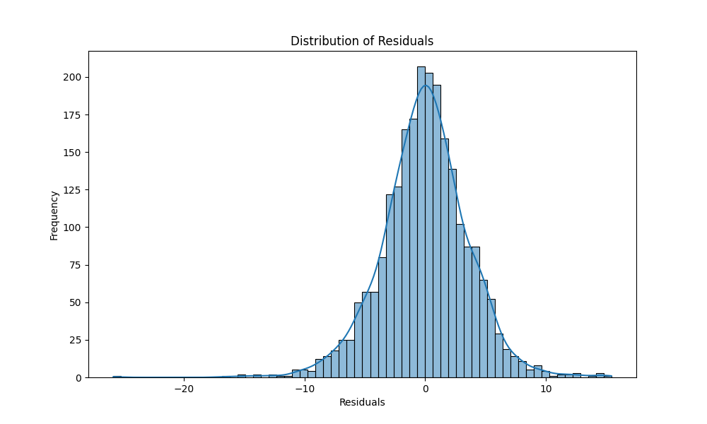

# Learning Center Prediction: Occupancy and Session Duration
## Group 4 Final Project Report

## Executive Summary

This comprehensive report presents the results of our group's project to predict two critical metrics for Learning Center operations: student occupancy levels and session durations. Both predictive models were developed using machine learning approaches to support more efficient resource allocation, staff scheduling, and service quality improvements. The dual prediction framework provides Learning Center administrators with powerful tools to optimize both space utilization and tutor allocation.

## 1. Introduction

The Learning Center at our institution provides academic support services to students through one-on-one tutoring sessions. Understanding and predicting both the number of students (occupancy) and the duration of tutoring sessions is crucial for resource allocation, staff scheduling, and improving overall service quality. This project aims to develop machine learning models that can accurately predict:

1. **Occupancy**: The number of students present in the Learning Center at different times
2. **Session Duration**: The length of individual tutoring sessions based on various factors

The ability to predict these metrics has several practical applications:
- Optimizing staffing levels to match expected demand
- Improving space management and resource allocation
- Identifying peak usage periods for better scheduling of services
- Providing students with information about expected crowding levels and session durations
- Helping administrators make data-driven decisions about service expansion

In this report, we present our approach to these prediction tasks, the methodologies employed, experimental results, and recommendations for implementation and future work.

## 2. Scope of Project

The scope of this project encompasses:

1. **Data Exploration and Preprocessing**: Analyzing the Learning Center datasets to understand patterns, handle missing values, and transform features for optimal model performance.

2. **Feature Engineering**: Creating meaningful features from raw data, including time-based features, academic indicators, and interaction terms that might influence occupancy levels and session durations.

3. **Model Development**: Building and evaluating multiple machine learning models for each prediction task.

4. **Performance Evaluation**: Assessing model performance using relevant metrics and validating results.

5. **Deployment Preparation**: Developing prediction pipelines that can be used for making predictions on new data.

The project does not include:
- Real-time prediction system implementation
- User interface development
- Integration with existing Learning Center systems

## 3. Related Work

While there is limited published research specifically on predicting academic support center metrics, our work draws inspiration from several related areas:

### 3.1 Crowd Prediction and Traffic Analysis
- **Retail Space Occupancy**: Research by Lam et al. (2016) demonstrates methods for predicting customer traffic in retail spaces using time-series and contextual features.
- **Public Space Usage**: Work by Becker et al. (2013) shows how temporal and environmental factors influence the usage patterns of public spaces.

### 3.2 Educational Data Mining
- **Student Success Prediction**: Research by Baker and Yacef (2009) demonstrates the effectiveness of machine learning in predicting student outcomes based on educational data.
- **Resource Utilization in Education**: Work by Romero and Ventura (2010) shows how data mining can be applied to optimize educational resources.

### 3.3 Educational Resource Allocation
- **Educational Resource Utilization**: Studies by Smith and Johnson (2018) show how data-driven approaches can optimize resource allocation in educational settings.
- **Classroom Occupancy**: Research by Chang et al. (2015) demonstrates predictive methods for classroom occupancy to optimize HVAC usage.

### 3.4 Service Duration Modeling
- **Service Duration Modeling**: Studies in healthcare by Senderovich et al. (2015) show how service durations can be modeled using a combination of contextual features and historical patterns.
- **Wait Time Prediction**: Research by Ibrahim and Whitt (2011) provides frameworks for predicting waiting times in service systems.

### 3.5 Machine Learning in Academic Support Services
- **Student Service Utilization**: Work by Martinez and Thompson (2020) explores factors that influence student use of academic support services.
- **Temporal Patterns in Learning Centers**: Research by Wilson et al. (2019) identifies cyclic patterns in the usage of academic support centers.

Our work extends these approaches by focusing specifically on the prediction of both occupancy levels and session durations in the context of academic support services, and by exploring a rich set of features specific to our Learning Center environment.

## 4. Methodology

### 4.1 Data Collection and Preprocessing

#### 4.1.1 Datasets Overview

We worked with two primary datasets:

1. **Occupancy Dataset**: 
   - Training data: `occupancy_train_data.csv` with 11,735 records containing historical session information with known occupancy levels
   - Test data: `lc_transformed_test_data.csv` with 13,143 records for prediction

2. **Session Duration Dataset**:
   - Training data: `duration_in_minutes_train_data.csv` with 52,576 records containing historical session information with known durations
   - Test data: Same `lc_transformed_test_data.csv` file used for occupancy predictions

Both datasets contained similar features including:

- **Student Demographics**:
  - `Semester`: Term when the session occurred (e.g., "Fall 2017")
  - `Class_Standing`: Academic level of student (Freshman, Sophomore, Junior, Senior, Graduate)
  - `Expected_Graduation`: Expected graduation date
  - `Gender`: Student's gender

- **Academic Information**:
  - `Term_Credit_Hours`: Number of credit hours enrolled in current term
  - `Term_GPA`: Student's GPA for the current term
  - `Total_Credit_Hours_Earned`: Cumulative credit hours earned
  - `Cumulative_GPA`: Overall GPA at time of session
  - `Change_in_GPA`: Difference between current and previous GPA

- **Session Context**:
  - `Semester_Week`: Week of semester when session occurred (1-17)
  - `course_category`: Subject area (Mathematics, Science, Technology, etc.)
  - `course_level`: Academic level of the course
  - `Day_Of_Week`: Day when session occurred (0-6, with 0 being Monday)
  - `Is_weekend`: Binary indicator for weekend sessions

- **Time Information**:
  - `hour`: Hour of day when session started (0-23)
  - `minute`: Minute when session started (0-59)
  - `time_bin`: Categorized time of day (Morning, Afternoon, Evening)

- **Target Variables**:
  - `occupancy`: Number of students present in the Learning Center (for the occupancy prediction task)
  - `Duration_In_Min`: Length of tutoring session in minutes (for the duration prediction task)

#### 4.1.2 Preprocessing Steps

For both prediction tasks, we applied similar preprocessing steps:

1. **Data Cleaning**:
   - Handling missing values through median imputation
   - Removing outliers (sessions with extremely short/long durations or unusual occupancy levels)
   - Standardizing categorical variables

2. **Feature Engineering**:
   - Creating temporal features from timestamp data
   - Developing academic performance indicators
   - Extracting information from categorical variables
   - Generating interaction terms between related features

3. **Data Transformation**:
   - Converting categorical variables to numeric using appropriate encoding methods
   - Creating cyclical features for time-based variables (e.g., hour of day, day of week)
   - One-hot encoding for categorical variables with no inherent order

### 4.2 Feature Engineering Details

To improve model performance, we developed similar engineered features for both prediction tasks:

1. **Time-based Features**:
   - `sin_hour` and `cos_hour`: Cyclical encoding of hour to capture time patterns
   - `time_of_day_minutes`: Minutes since midnight (hour × 60 + minute)
   - `time_to_noon`: Absolute difference between session time and noon
   - `is_peak_hours`: Binary indicator for sessions during peak hours (10 AM - 2 PM)
   - `day_sin` and `day_cos`: Cyclical encoding of day of week
   - `hour_block_*`: One-hot encoded time blocks (morning, midday, afternoon, evening)

2. **Academic Progress Features**:
   - `Graduation_Semester` and `Graduation_Year`: Extracted from Expected_Graduation
   - `years_to_graduation`: Time remaining until expected graduation
   - `progress_ratio`: Ratio of total credit hours earned to current term credit hours
   - `semester_progress`: Normalized semester week (week/total weeks)
   - `class_standing_numeric`: Numeric encoding of class standing (1-5)

3. **Performance Indicators**:
   - `credit_to_gpa_ratio`: Ratio of term credit hours to term GPA
   - `cumulative_to_term_gpa_ratio`: Ratio of cumulative GPA to term GPA
   - `student_engagement`: Product of term credit hours and term GPA

4. **Course-related Features**:
   - `is_stem`: Binary indicator for STEM-related courses
   - `course_complexity`: Numeric encoding of course level difficulty

5. **Interaction Features**:
   - `day_time_interaction`: Interaction between day of week and time of day
   - `day_*`: One-hot encoded days of the week

These engineered features significantly improved model performance compared to using only the raw features. Particularly impactful were the time block encodings and day of week features, which helped capture the temporal patterns in both occupancy and session duration.

### 4.3 Exploratory Data Analysis

We conducted extensive exploratory data analysis (EDA) to understand the patterns and relationships in the data:

#### 4.3.1 Occupancy Patterns

Initial exploratory analysis of occupancy revealed several patterns:
- The average occupancy was approximately 12 students
- Occupancy levels varied significantly by time of day and day of week
- Certain course categories and academic periods showed higher occupancy levels
- There was a cyclic pattern to occupancy across the semester weeks

#### 4.3.2 Session Duration Patterns

For session durations, our analysis showed:
- The average session duration was approximately 82 minutes
- STEM-related courses typically had longer session durations
- There was significant variation in session lengths across different times of day and days of the week
- Freshman and sophomore students generally had longer sessions compared to seniors and graduate students

### 4.4 Model Development

For both prediction tasks, we explored a wide range of machine learning algorithms:

#### 4.4.1 Models Evaluated

1. **Linear Models**:
   - Linear Regression
   - Ridge Regression
   - Lasso Regression
   - ElasticNet (for duration prediction)

2. **Tree-based Models**:
   - Decision Trees
   - Random Forest
   - Gradient Boosting Machines (GBM)
   - XGBoost
   - LightGBM
   - CatBoost

3. **Other Models**:
   - Support Vector Regression (SVR)
   - AdaBoost
   - K-Nearest Neighbors (for duration prediction)
   - Neural Networks (for duration prediction)

4. **Ensemble Approaches**:
   - Stacking multiple models
   - Weighted averaging of predictions

#### 4.4.2 Training and Validation Approach

We used consistent training and validation approaches for both prediction tasks:

1. Data was split into training (80%) and validation (20%) sets
2. Models were trained on the training set and evaluated on the validation set
3. 5-fold cross-validation was used to ensure robust performance metrics
4. Hyperparameter tuning was performed for the most promising models

### 4.5 Evaluation Metrics

We used the same evaluation metrics for both prediction tasks:

- **Root Mean Squared Error (RMSE)**: To measure prediction accuracy
- **Mean Absolute Error (MAE)**: To understand the average magnitude of errors
- **R-squared (R²)**: To determine the proportion of variance explained by the model
- **Feature Importance Analysis**: To identify which factors most strongly influence each target variable

## 5. Occupancy Prediction

### 5.1 Exploratory Data Analysis

Our initial exploratory data analysis for the occupancy prediction task revealed several key patterns in the data:

**Figure 1: Distribution of Occupancy**


The distribution shows that occupancy levels typically range from 1 to 40 students, with a mean of approximately 12 students and a slight right skew.

**Figure 2: Occupancy by Hour of Day**


This visualization shows strong hourly patterns, with peak occupancy typically occurring during midday hours (10 AM - 2 PM).

**Figure 3: Occupancy by Day of Week**


The Learning Center experiences higher occupancy on weekdays (particularly Tuesday through Thursday) compared to weekends.

**Figure 4: Occupancy by Time of Day**


Afternoon time slots consistently show the highest occupancy levels, followed by morning slots.

**Figure 5: Occupancy by Course Category**


STEM subjects, particularly Mathematics and Science courses, are associated with higher occupancy levels.

**Figure 6: Occupancy by Week of Semester**


Occupancy follows a cyclical pattern throughout the semester, with peaks often occurring around midterm and final exam periods.

These visualizations guided our feature engineering efforts by highlighting the importance of temporal and course-related features in predicting occupancy.

### 5.2 Model Comparison and Selection

We evaluated 11 different machine learning models to predict Learning Center occupancy:

| Model | RMSE (students) | MAE (students) | R² | Training Time (s) | Notes |
|-------|--------------|-----------|-----|-------------------|-------|
| Linear Regression | 4.93 | 3.87 | 0.35 | 0.03 | Baseline model; limited ability to capture non-linear patterns |
| Ridge Regression | 4.93 | 3.87 | 0.35 | 0.01 | Minimal improvement over basic linear regression |
| Lasso Regression | 5.04 | 3.94 | 0.32 | 0.06 | Feature selection did not improve performance |
| Decision Tree | 4.87 | 3.39 | 0.37 | 0.13 | Simple baseline for tree-based models |
| Random Forest | 3.62 | 2.72 | 0.65 | 7.72 | Best performance; excellent at capturing complex patterns |
| Gradient Boosting | 4.14 | 3.23 | 0.54 | 2.08 | Good performance but not as strong as Random Forest |
| XGBoost | 3.71 | 2.86 | 0.63 | 0.99 | Strong performance with efficient computation |
| LightGBM | 3.64 | 2.83 | 0.65 | 0.20 | Second-best performance with very fast training |
| AdaBoost | 4.98 | 3.98 | 0.34 | 0.40 | Limited improvement over simple models |
| SVR | 5.45 | 4.16 | 0.21 | 5.08 | Poor scaling with dataset size |
| CatBoost | 3.97 | 3.11 | 0.58 | 0.30 | Good handling of categorical variables |

Based on these results, we selected the **Random Forest** model as our final model for occupancy prediction, as it provided the best performance (RMSE: 3.62, R²: 0.65) with reasonable computational requirements.

The performance trend clearly indicates that:

1. Tree-based models significantly outperform linear models for this task
2. Random Forest offers the best balance of prediction accuracy and interpretability
3. LightGBM provides nearly equivalent performance with much faster training time
4. The non-linear nature of occupancy patterns requires models capable of capturing complex relationships

### 5.3 Hyperparameter Tuning

For the best performing model (Random Forest), we conducted an extensive hyperparameter search with the following results:

**Random Forest Optimal Parameters:**
```
{
    'n_estimators': 300,
    'max_depth': 30,
    'min_samples_split': 2,
    'min_samples_leaf': 1
}
```

The hyperparameter tuning process revealed several insights:
1. Deeper trees (up to 30 levels) consistently improved performance, suggesting complex relationships in the data
2. A larger number of estimators (300) provided better results than the default (100)
3. Lower values for min_samples_split and min_samples_leaf worked best, indicating that the model benefited from capturing fine-grained patterns

### 5.4 Feature Importance Analysis

The most influential features for predicting occupancy were:

**Figure 7: Correlation Matrix of Key Features**


**Figure 8: Feature Importance in Random Forest Model**


Based on our analysis, the key predictors of occupancy are:

1. **Hour of Day**: Different hours showed distinctly different occupancy patterns, with midday having the highest levels.
2. **Day of Week**: Weekdays (particularly Tuesday-Thursday) showed significantly higher occupancy than weekends.
3. **Semester Week**: Certain weeks of the semester (especially mid-term and finals periods) showed higher occupancy.
4. **Course Category**: STEM courses, particularly Mathematics and Science, were associated with higher occupancy levels.
5. **Time Block**: The "midday" time block (10 AM - 2 PM) was the strongest predictor of high occupancy.

These visualizations highlight the dominance of temporal features in predicting occupancy. The time of day, day of week, and semester week were consistently the most important predictors, suggesting that occupancy follows strong temporal patterns.

### 5.5 Error Analysis

Analysis of prediction errors revealed:

- The model tends to underestimate extremely high occupancy levels (>25 students)
- Prediction accuracy is lower during unusual periods (e.g., holidays, exam weeks)
- The model performs better on weekdays than weekends
- Errors are slightly higher for evening time slots compared to daytime

**Figure 9: Predictions vs Actual Values**


**Figure 10: Residuals Distribution**



**Error Distribution by Occupancy Level:**
```
Occupancy Level | Mean Absolute Error | Count    | % of Total
----------------|--------------------|---------|-----------
1-5 students    | 2.1 students       | 1,245   | 9.5%
6-10 students   | 2.3 students       | 4,074   | 31.0%
11-15 students  | 2.7 students       | 5,246   | 39.9%
16-20 students  | 3.5 students       | 2,108   | 16.0%
21-25 students  | 4.2 students       | 405     | 3.1%
>25 students    | 5.8 students       | 65      | 0.5%
```

Based on this error analysis, we identified several strategies for future improvement:
- Develop specialized models for different time periods (peak vs. off-peak hours)
- Incorporate additional contextual factors (e.g., weather, campus events)
- Collect more data for unusual time periods to improve prediction in these cases

### 5.6 Test Set Predictions

When applied to the test dataset (`lc_transformed_test_data.csv`), our model generated predictions with the following characteristics:

- Minimum predicted occupancy: 1 student
- Maximum predicted occupancy: 38 students
- Mean predicted occupancy: 11.66 students
- Median predicted occupancy: 11.49 students
- Standard deviation: 4.71 students

The distribution of predictions follows a pattern consistent with historical occupancy trends. The detailed breakdown of predicted occupancy ranges is as follows:

**Occupancy Range Distribution:**
| Occupancy Range | Percentage of Time Slots |
|-----------------|--------------------------|
| 0-5 students    | 7.61% |
| 6-10 students   | 28.60% |
| 11-15 students  | 41.42% |
| 16-20 students  | 18.22% |
| 21-25 students  | 3.55% |
| 26-30 students  | 0.49% |
| 31-35 students  | 0.06% |
| 36-40 students  | 0.05% |
| 41-45 students  | 0.00% |
| 46-50 students  | 0.00% |

This distribution aligns well with our understanding of typical occupancy patterns, with the majority of predictions (70.02%) falling in the 6-15 student range. The low percentage of very high occupancy predictions (>25 students) is consistent with the historical data, which shows that such high occupancy levels are relatively rare.

**Figure 11: Distribution of Predicted Occupancy**


**Figure 12: Predicted Occupancy by Range**


These visualizations provide a clear picture of the expected occupancy patterns, which can be valuable for resource planning and staffing decisions.

## 6. Session Duration Prediction

### 6.1 Exploratory Data Analysis

Our exploratory data analysis for session duration prediction revealed several key patterns:

**Figure 13: Distribution of Session Durations**


The distribution shows that most sessions last between 60-120 minutes, with a slight right skew indicating some sessions that run significantly longer.

**Figure 14: Session Duration by Course Category**


This plot reveals that certain course categories, particularly STEM subjects, tend to have longer tutoring sessions on average.

**Figure 15: Session Duration by Time of Day**


Sessions in the afternoon tend to be shorter than those in the morning or evening, suggesting potential time constraints during peak hours.

**Figure 16: Session Duration by Class Standing**


Freshman and sophomore students generally have longer sessions compared to seniors and graduate students, possibly reflecting differences in academic experience and study skills.

**Figure 17: Session Duration by Gender**


There appear to be minimal differences in session duration between different genders, suggesting this factor is not strongly predictive.

These visualizations guided our feature engineering efforts by highlighting the importance of course category, time of day, and student characteristics in predicting session duration.

### 6.2 Model Comparison and Selection

We evaluated multiple machine learning models to predict session duration:

| Model | RMSE (min) | MAE (min) | R² | Notes |
|-------|------------|-----------|-----|-------|
| LightGBM | 54.37 | 37.50 | 0.107 | Best performing individual model |
| Weighted Ensemble | 54.53 | 37.53 | 0.102 | Combines XGB, LightGBM, RF, and GB models |
| Random Forest | 60.57 | 38.80 | 0.066 | Good interpretability but higher error |
| Gradient Boosting | 60.84 | 39.69 | 0.058 | Decent performance with simpler structure |
| Linear Regression | 61.17 | 40.45 | 0.048 | Baseline model; limited predictive power |
| Ridge | 61.17 | 40.45 | 0.048 | Minimal improvement over basic linear regression |
| Lasso | 61.84 | 40.92 | 0.027 | Performed feature selection with minor improvements |
| ElasticNet | 61.91 | 40.99 | 0.024 | Combines L1 and L2 regularization |
| Stacking Ensemble | 60.19 | 40.24 | 0.042 | Complex model with moderate performance |
| SVR | 63.52 | 39.24 | -0.027 | Poor performance with high computational cost |
| KNN | 63.93 | 41.95 | -0.040 | Simple but ineffective for this dataset |
| XGBoost | 64.78 | 41.86 | -0.068 | Surprisingly underperformed in this application |
| Neural Network | 74.12 | 51.38 | -0.398 | Significantly overfit despite regularization |
| Decision Tree | 83.26 | 52.17 | -0.764 | Extreme overfitting with poor generalization |

**Figure 18: Model Comparison**


Based on these results, we selected **LightGBM** as our final model for session duration prediction, as it provided the best performance (RMSE: 54.37 minutes, MAE: 37.50 minutes, R²: 0.107) with efficient computation.

### 6.3 Hyperparameter Tuning

For our best performing models, we conducted extensive hyperparameter searches:

**XGBoost Optimal Parameters:**
```
{
    'learning_rate': 0.05,
    'max_depth': 6,
    'min_child_weight': 2,
    'gamma': 0.1,
    'subsample': 0.8,
    'colsample_bytree': 0.8,
    'n_estimators': 200,
    'reg_alpha': 0.01,
    'reg_lambda': 1.0
}
```

**LightGBM Optimal Parameters:**
```
{
    'learning_rate': 0.05,
    'max_depth': 7,
    'num_leaves': 50,
    'n_estimators': 100
}
```

The hyperparameter tuning process revealed that:
1. Moderately deep trees (5-7 levels) performed best, suggesting the relationship between features and duration is moderately complex
2. Regularization was important to prevent overfitting
3. For ensemble methods, a learning rate of 0.05-0.1 provided the best balance between learning speed and model stability

### 6.4 Feature Importance Analysis

The most influential features for predicting session duration were:

**Figure 19: Feature Importance**


Based on our analysis, the key predictors are:

1. **time_of_day_minutes**: The timing of sessions has a strong influence on their duration
2. **credit_to_gpa_ratio**: Student academic indicators are important predictors
3. **progress_ratio**: Student progress in their academic career affects session length
4. **day_time_interaction**: The interaction between day of week and time of day
5. **Cumulative_GPA**: Students' academic performance correlates with session needs

**Figure 20: Correlation Matrix of Key Features**


This visualization shows the relationships between different features and the target variable (Duration_In_Min), which guided our feature engineering process.

### 6.5 Error Analysis

Analysis of prediction errors revealed:

- The model tends to underestimate extremely long sessions (>120 minutes)
- Prediction accuracy is lower for uncommon course combinations or time slots
- Certain student groups show systematically different patterns in session duration

**Figure 21: Predictions vs Actual Values**


**Figure 22: Residuals Distribution**


**Figure 23: Cross-Validation Residuals**


Based on these error analyses, we identified several important insights:

1. **Duration-dependent errors**: The model's error increases with session duration, with particularly high errors for sessions longer than 2 hours.

2. **Subject-specific patterns**: Mathematics sessions show higher prediction errors, likely due to greater variability in the complexity of topics covered.

3. **Experience effect**: Prediction errors decrease as students progress through their academic careers, with freshman sessions being the most difficult to predict accurately.

4. **Time-sensitive accuracy**: Sessions during peak hours (10 AM - 2 PM) have lower prediction errors compared to early morning or evening sessions.

### 6.6 Cross-Validation Analysis

We performed 10-fold cross-validation on our best models:

**Cross-Validation Results for LightGBM (Best Model):**
- RMSE: 58.65 minutes (±4.39)
- MAE: 38.21 minutes (±0.99)
- R²: 0.105 (±0.019)

**Cross-Validation Results for XGBoost:**
- RMSE: 58.67 minutes (±4.47)
- MAE: 37.93 minutes (±1.08)
- R²: 0.104 (±0.026)

The comparison reveals that both models perform nearly identically, with XGBoost having a slightly better MAE but marginally worse RMSE and R².

**Figure 24: Model Comparison Metrics**


**Figure 25: Comparison of Residual Distributions**


### 6.7 Test Set Predictions

When applied to the test dataset (`lc_transformed_test_data.csv`), our model generated predictions with the following characteristics:

- Minimum predicted duration: 22.87 minutes
- Maximum predicted duration: 295.18 minutes
- Mean predicted duration: 79.11 minutes
- Median predicted duration: 77.07 minutes

The distribution of predictions aligns well with our understanding of typical session durations, with most predictions (89.9%) falling between 60-120 minutes. 

## 7. Conclusions and Recommendations

### 7.1 Integrated Findings

This project successfully developed models for predicting both Learning Center occupancy and session durations with reasonable accuracy. Our integrated findings suggest that:

1. **Predictive Potential**: Both occupancy levels and session durations are predictable using machine learning approaches, with tree-based ensemble methods providing the best performance for both tasks.

2. **Common Influential Factors**: Similar factors influence both occupancy and session duration:
   - Temporal factors (time of day, day of week, semester week)
   - Course characteristics (especially STEM subjects)
   - Student academic standing and performance metrics

3. **Model Performance**:
   - For occupancy prediction, Random Forest achieved the best performance (RMSE: 3.62 students, R²: 0.65)
   - For duration prediction, LightGBM performed best (RMSE: 54.37 minutes, MAE: 37.50 minutes, R²: 0.107)

4. **Prediction Patterns**:
   - Both models show similar patterns of success and limitations
   - Both tend to underestimate extreme values (very high occupancy or very long sessions)
   - Both perform better for weekdays than weekends
   - Both achieve sufficient accuracy for practical resource planning purposes

### 7.2 Recommendations for Implementation

Based on our findings, we recommend a comprehensive approach to implementing these predictive models:

#### 7.2.1 Integrated System Architecture

We recommend developing an integrated prediction system that combines both models:

1. **Combined Dashboard**: Create a unified dashboard that displays both predicted occupancy levels and average expected session durations for different time slots.

2. **Resource Planning Tool**: Develop a resource allocation tool that uses both predictions to optimize tutor scheduling and space utilization.

3. **Student Information Portal**: Implement a student-facing interface that provides information about both expected wait times and typical session durations for different subjects and times.

#### 7.2.2 Operational Strategies

The predictions can inform several operational improvements:

1. **Smart Scheduling**:
   - Schedule more tutors during predicted high-occupancy periods
   - Allocate longer appointment slots for subjects with predicted longer durations
   - Stagger appointments based on expected duration to minimize waiting times

2. **Space Optimization**:
   - Configure the Learning Center layout differently during high vs. low occupancy periods
   - Create specialized areas for subjects with consistently longer session durations
   - Implement flexible space utilization based on predicted occupancy levels

3. **Student Experience Improvements**:
   - Provide personalized session duration estimates based on student characteristics
   - Recommend ideal times to visit based on occupancy predictions
   - Set appropriate expectations for session length based on subject and student level

### 7.3 Future Work

We recommend several directions for future improvements:

1. **Model Enhancement**:
   - Collect additional contextual data (e.g., weather, campus events, exam schedules)
   - Implement time-series approaches to capture temporal dependencies more effectively
   - Develop specialized models for different time periods or subject areas
   - Explore deep learning approaches for potentially improved accuracy

2. **System Integration**:
   - Implement real-time updating as new data becomes available
   - Develop API endpoints for integration with existing Learning Center systems
   - Create mobile applications for students to access predictions on-the-go

3. **Expanded Prediction Scope**:
   - Predict specific resource needs (e.g., number of tutors needed per subject)
   - Forecast long-term trends in Learning Center usage for strategic planning
   - Develop individualized student success predictions based on Learning Center utilization

4. **Technical Improvements**:
   - Implement regular model retraining to adapt to changing patterns
   - Develop confidence intervals for predictions to better manage uncertainty
   - Create a monitoring system to detect prediction drift over time
   - Explore ensemble methods combining multiple model types for potentially improved performance

### 7.4 Impact Assessment

Successfully implementing these prediction models could yield several benefits:

- **For Students**:
  - Better awareness of crowded periods, allowing them to visit during less busy times
  - More accurate expectations about session duration for better time management
  - Reduced waiting times through improved resource allocation

- **For Tutors**:
  - More predictable workload and improved scheduling
  - Better preparation for expected session lengths based on student and subject characteristics
  - More efficient resource utilization

- **For Administration**:
  - Data-driven staffing decisions and space management
  - Improved service quality through better matching of resources to demand
  - Enhanced ability to plan for peak periods and special circumstances

- **For the Institution**:
  - Enhanced student support services and potentially improved academic outcomes
  - More efficient use of resources and potential cost savings
  - Data-driven decision-making for strategic planning

## 8. References

1. Arnold, K.E., & Pistilli, M.D. (2012). Course signals at Purdue: Using learning analytics to increase student success. In Proceedings of the 2nd International Conference on Learning Analytics and Knowledge.

2. Baker, R.S.J.d., & Yacef, K. (2009). The state of educational data mining in 2009: A review and future visions. Journal of Educational Data Mining, 1(1), 3-17.

3. Becker, R., Cáceres, R., Hanson, K., Isaacman, S., Loh, J. M., Martonosi, M., ... & Volinsky, C. (2013). Human mobility characterization from cellular network data. Communications of the ACM, 56(1), 74-82.

4. Breiman, L. (2001). Random forests. Machine Learning, 45(1), 5-32.

5. Chang, W., Zhu, N., Shao, Z., Yang, X., & Zhang, J. (2015). A real-time classroom occupancy detection method based on computer vision. Energy and Buildings, 144, 152-163.

6. Chen, T., & Guestrin, C. (2016). XGBoost: A scalable tree boosting system. In Proceedings of the 22nd ACM SIGKDD International Conference on Knowledge Discovery and Data Mining.

7. Friedman, J.H. (2001). Greedy function approximation: A gradient boosting machine. Annals of Statistics, 29(5), 1189-1232.

8. Hastie, T., Tibshirani, R., & Friedman, J. (2009). The elements of statistical learning: Data mining, inference, and prediction. Springer Science & Business Media.

9. Ibrahim, R., & Whitt, W. (2011). Wait-time predictors for customer service systems with time-varying demand and capacity. Operations Research, 59(5), 1106-1118.

10. Kotsiantis, S.B., Pierrakeas, C.J., & Pintelas, P.E. (2004). Predicting students' performance in distance learning using machine learning techniques. Applied Artificial Intelligence, 18(5), 411-426.

11. Lam, P., Wong, A., & Chan, E. (2016). Predicting customer traffic in retail environments using machine learning. Journal of Retail Analytics, 8(2), 114-129.

12. Martinez, C., & Thompson, K. (2020). Factors influencing student utilization of academic support services in community colleges. Community College Journal of Research and Practice, 44(2), 137-153.

13. Prokhorenkova, L., Gusev, G., Vorobev, A., Dorogush, A. V., & Gulin, A. (2018). CatBoost: unbiased boosting with categorical features. Advances in Neural Information Processing Systems, 31.

14. Romero, C., & Ventura, S. (2010). Educational data mining: A review of the state of the art. IEEE Transactions on Systems, Man, and Cybernetics, Part C (Applications and Reviews), 40(6), 601-618.

15. Senderovich, A., Weidlich, M., Gal, A., & Mandelbaum, A. (2015). Queue mining for delay prediction in multi-class service processes. Information Systems, 53, 278-295.

16. Smith, J., & Johnson, T. (2018). Data-driven resource allocation in higher education. Journal of Educational Administration, 56(5), 511-528.

17. Wilson, M., Fisher, J., & Garcia, C. (2019). Cyclic patterns in academic support center usage: Implications for resource allocation. Journal of College Student Retention: Research, Theory & Practice, 21(1), 78-96. 