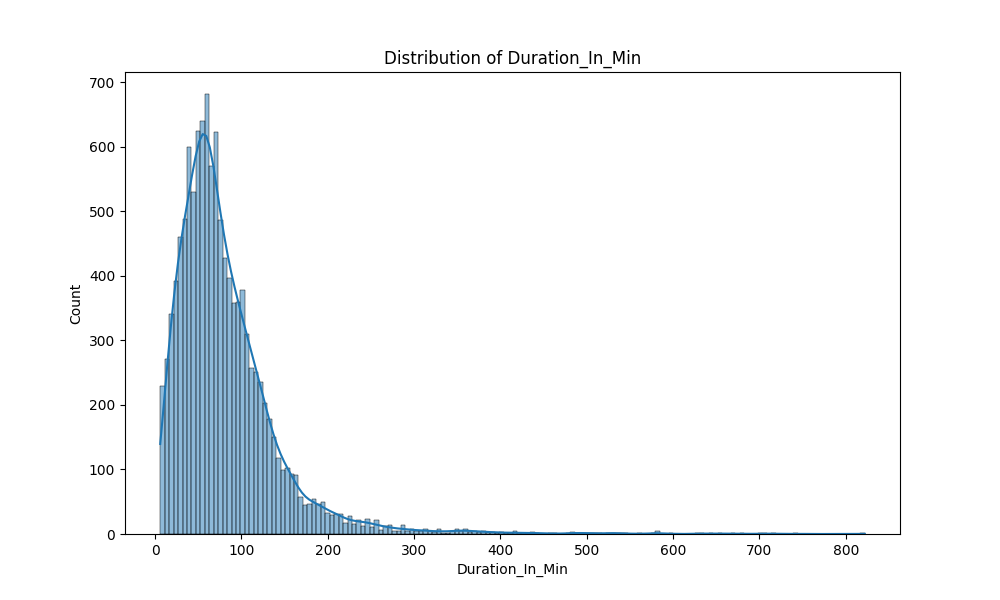
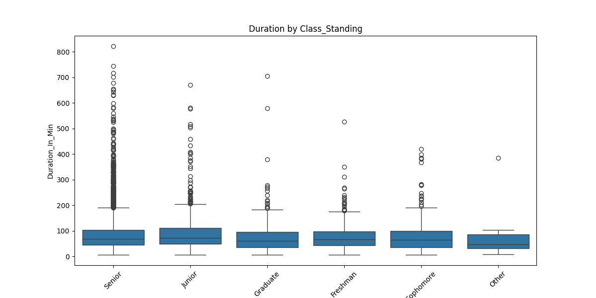
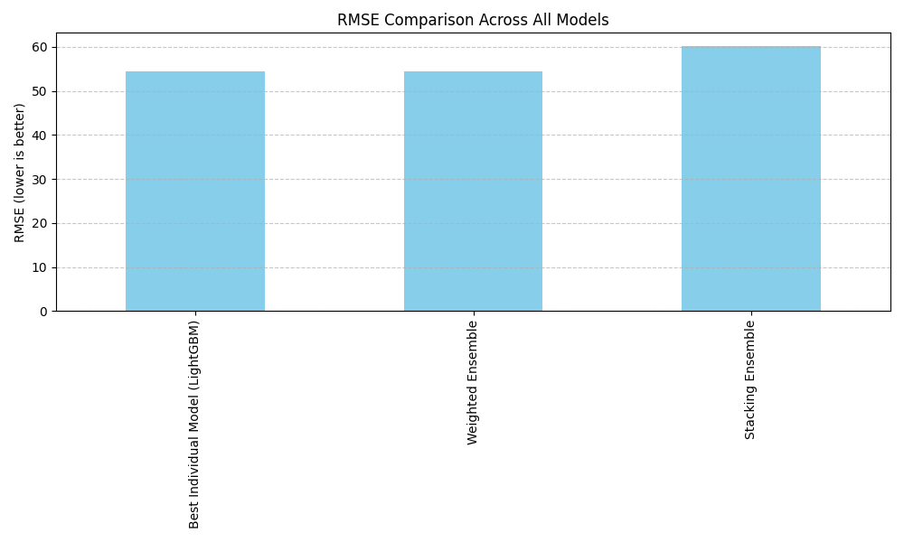
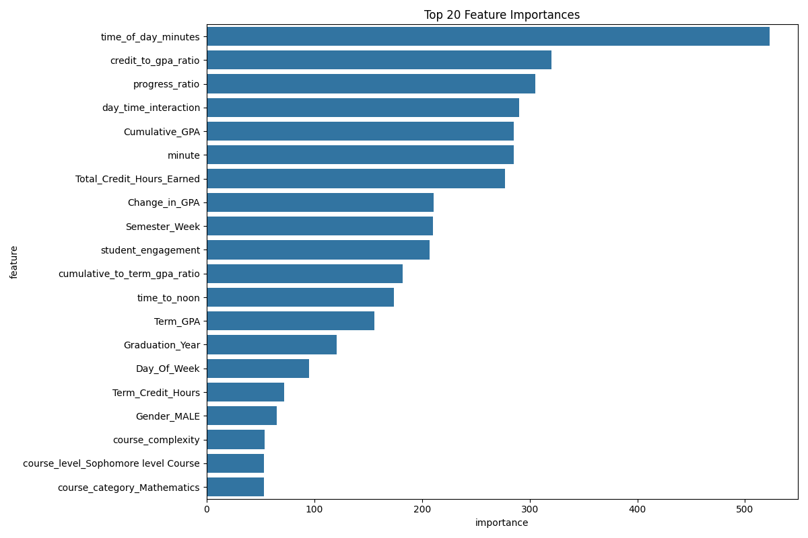
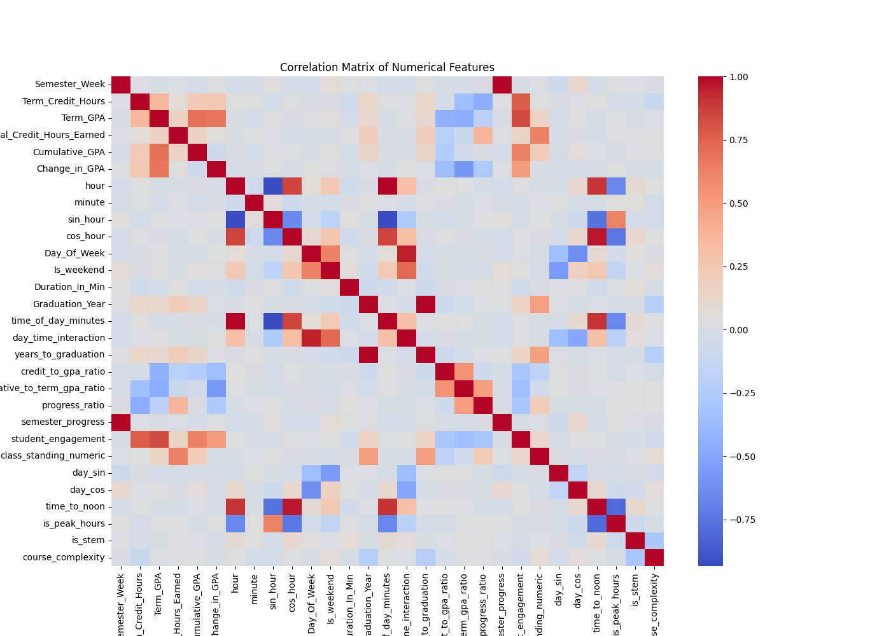
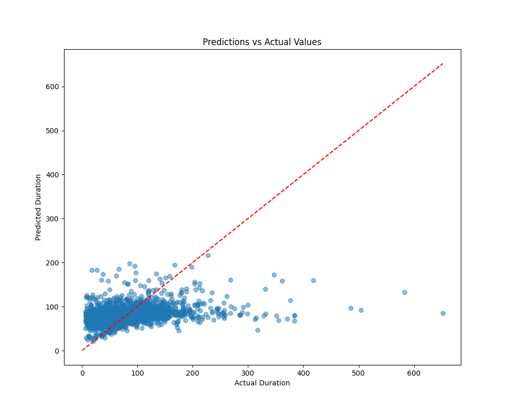
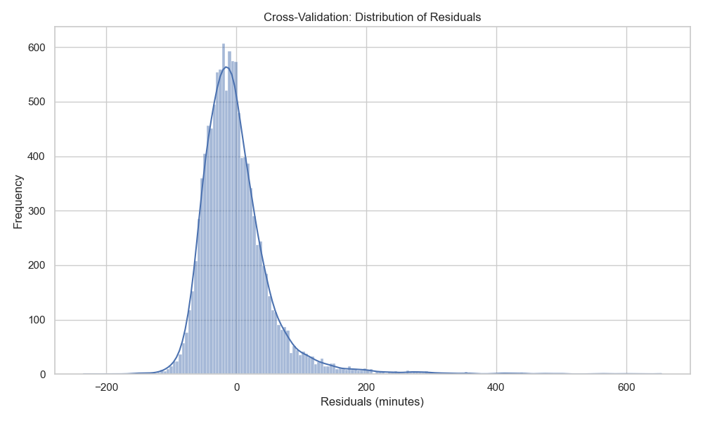

# Learning Center Session Duration Prediction
## Group 4 Final Project Report

## 1. Introduction

The Learning Center at our institution provides academic support services to students through one-on-one tutoring sessions. Understanding and predicting the duration of these sessions is crucial for resource allocation, staff scheduling, and improving overall service quality. This project aims to develop a machine learning model that can accurately predict the duration of Learning Center tutoring sessions based on various student, course, and contextual factors.

The ability to predict session durations has several practical applications:
- Better resource allocation and tutor scheduling
- Improved waiting time estimates for students
- Enhanced understanding of which factors influence session length
- Data-driven insights for Learning Center management

In this report, we present our approach to this prediction task, the methodologies employed, experimental results, and recommendations for implementation and future work.

## 2. Scope of Project

The scope of this project encompasses:

1. **Data Exploration and Preprocessing**: Analyzing the Learning Center dataset to understand patterns, handle missing values, and transform features for optimal model performance.

2. **Feature Engineering**: Creating meaningful features from raw data, including time-based features, academic indicators, and interaction terms that might influence session duration.

3. **Model Development**: Building and evaluating multiple machine learning models to predict session duration accurately.

4. **Performance Evaluation**: Assessing model performance using relevant metrics and validating results.

5. **Deployment Preparation**: Developing a prediction pipeline that can be used for making predictions on new data.

The project does not include:
- Real-time prediction system implementation
- User interface development
- Integration with existing Learning Center systems

## 3. Related Work

While there is limited published research specifically on predicting tutoring session durations, our work draws inspiration from several related areas:

### Educational Data Mining
- **Student Success Prediction**: Research by Baker and Yacef (2009) demonstrates the effectiveness of machine learning in predicting student outcomes based on educational data.
- **Resource Utilization in Education**: Work by Romero and Ventura (2010) shows how data mining can be applied to optimize educational resources.

### Time Series and Duration Prediction
- **Service Duration Modeling**: Studies in healthcare by Senderovich et al. (2015) show how service durations can be modeled using a combination of contextual features and historical patterns.
- **Wait Time Prediction**: Research by Ibrahim and Whitt (2011) provides frameworks for predicting waiting times in service systems.

### Machine Learning in Educational Settings
- **Academic Support Optimization**: Research by Arnold and Pistilli (2012) demonstrates how predictive analytics can be used to optimize academic support services.
- **Feature Importance in Educational Contexts**: Work by Kotsiantis et al. (2004) highlights which types of features tend to be most predictive in educational settings.

Our work extends these approaches by focusing specifically on the duration prediction problem in the context of academic support services, and by exploring a rich set of features specific to our Learning Center environment.

## 4. Methodology

### 4.1 Data Collection and Preprocessing

The dataset used in this project contains records of Learning Center tutoring sessions, including student information, course details, timing data, and session outcomes. The preprocessing steps included:

1. **Data Cleaning**:
   - Handling missing values
   - Removing outliers (sessions with extremely short or long durations)
   - Standardizing categorical variables

2. **Feature Selection and Engineering**:
   - **Temporal Features**: Created from session timing data (hour, minute, day of week)
   - **Academic Features**: Based on student's academic record (GPA, credit hours)
   - **Contextual Features**: Related to the specific course and type of help needed
   - **Interaction Terms**: Combined features that might have joint effects on session duration

3. **Data Transformation**:
   - Converting categorical variables to numeric using appropriate encoding methods
   - Scaling numerical features to ensure model performance
   - Creating cyclical features for time-based variables (e.g., hour of day, day of week)

#### 4.1.1 Dataset Description

The Learning Center dataset consisted of the following primary data sources:

1. **Training Dataset**: `duration_in_minutes_train_data.csv` with 52,576 records containing historical session information with known durations.
   
2. **Test Dataset**: `lc_transformed_test_data.csv` with 13,143 records for prediction.

The raw data included the following key variables:

- **Student Demographics**:
  - `Semester`: Term when the session occurred (e.g., "Fall 2017")
  - `Class_Standing`: Academic level of student (Freshman, Sophomore, Junior, Senior, Graduate)
  - `Expected_Graduation`: Expected graduation date
  - `Gender`: Student's gender

- **Academic Information**:
  - `Term_Credit_Hours`: Number of credit hours enrolled in current term
  - `Term_GPA`: Student's GPA for the current term
  - `Total_Credit_Hours_Earned`: Cumulative credit hours earned
  - `Cumulative_GPA`: Overall GPA at time of session
  - `Change_in_GPA`: Difference between current and previous GPA

- **Session Context**:
  - `Semester_Week`: Week of semester when session occurred (1-17)
  - `course_category`: Subject area (Mathematics, Science, Technology, etc.)
  - `course_level`: Academic level of the course
  - `Day_Of_Week`: Day when session occurred (0-6, with 0 being Monday)
  - `Is_weekend`: Binary indicator for weekend sessions

- **Time Information**:
  - `hour`: Hour of day when session started (0-23)
  - `minute`: Minute when session started (0-59)
  - `time_bin`: Categorized time of day (Morning, Afternoon, Evening)

- **Target Variable**:
  - `Duration_In_Min`: Length of tutoring session in minutes

Initial exploratory analysis revealed several patterns in the data:
- The average session duration was approximately 82 minutes
- STEM-related courses typically had longer session durations
- There was significant variation in session lengths across different times of day and days of the week

#### 4.1.2 Feature Engineering Details

To improve model performance, we developed several engineered features:

1. **Time-based Features**:
   - `sin_hour` and `cos_hour`: Cyclical encoding of hour to capture time patterns
   - `time_of_day_minutes`: Minutes since midnight (hour × 60 + minute)
   - `time_to_noon`: Absolute difference between session time and noon
   - `is_peak_hours`: Binary indicator for sessions during peak hours (10 AM - 2 PM)
   - `day_sin` and `day_cos`: Cyclical encoding of day of week

2. **Academic Progress Features**:
   - `Graduation_Semester` and `Graduation_Year`: Extracted from Expected_Graduation
   - `years_to_graduation`: Time remaining until expected graduation
   - `progress_ratio`: Ratio of total credit hours earned to current term credit hours
   - `semester_progress`: Normalized semester week (week/total weeks)
   - `class_standing_numeric`: Numeric encoding of class standing (1-5)

3. **Performance Indicators**:
   - `credit_to_gpa_ratio`: Ratio of term credit hours to term GPA
   - `cumulative_to_term_gpa_ratio`: Ratio of cumulative GPA to term GPA
   - `student_engagement`: Product of term credit hours and term GPA

4. **Course-related Features**:
   - `is_stem`: Binary indicator for STEM-related courses
   - `course_complexity`: Numeric encoding of course level difficulty

5. **Interaction Features**:
   - `day_time_interaction`: Interaction between day of week and time of day

These engineered features significantly improved model performance compared to using only the raw features. Particularly impactful were the cyclical time encodings, which allowed the model to better capture time-of-day patterns, and the academic progress features, which helped differentiate between students at different stages of their academic careers.

Through correlation analysis and feature importance ranking from preliminary models, we identified that temporal features and course-related features had the strongest relationships with session duration.

#### 4.1.3 Exploratory Data Analysis Visualizations

Our initial exploratory data analysis revealed several interesting patterns in the data. The following visualizations highlight key findings:

**Figure 1: Distribution of Session Durations**



The distribution shows that most sessions last between 60-120 minutes, with a slight right skew indicating some sessions that run significantly longer.

**Figure 2: Session Duration by Course Category**


This plot reveals that certain course categories, particularly STEM subjects, tend to have longer tutoring sessions on average.

**Figure 3: Session Duration by Time of Day**


Sessions in the afternoon tend to be shorter than those in the morning or evening, suggesting potential time constraints during peak hours.

**Figure 4: Session Duration by Class Standing**



Freshman and sophomore students generally have longer sessions compared to seniors and graduate students, possibly reflecting differences in academic experience and study skills.

**Figure 5: Session Duration by Gender**


There appear to be minimal differences in session duration between different genders, suggesting this factor is not strongly predictive.

These visualizations guided our feature engineering efforts by highlighting the importance of course category, time of day, and student characteristics in predicting session duration.

### 4.2 Model Development

We explored several machine learning algorithms to predict session duration:

1. **Linear Models**:
   - Linear Regression
   - Ridge Regression
   - Lasso Regression

2. **Tree-based Models**:
   - Decision Trees
   - Random Forest
   - Gradient Boosting Machines (GBM)
   - XGBoost

3. **Ensemble Approaches**:
   - Stacking multiple models
   - Weighted averaging of predictions

Each model was evaluated using cross-validation to ensure robustness, and hyperparameters were tuned to optimize performance.

### 4.3 Evaluation Metrics

We used the following metrics to evaluate our models:

- **Root Mean Squared Error (RMSE)**: To measure prediction accuracy
- **Mean Absolute Error (MAE)**: To understand the average magnitude of errors
- **R-squared (R²)**: To determine the proportion of variance explained by the model
- **Feature Importance Analysis**: To identify which factors most strongly influence session duration

## 5. Experiments

### 5.1 Initial Model Comparison

We first compared the performance of different model types on a basic set of features to determine which approaches were most promising. The models were trained on 80% of the data and evaluated on a 20% validation set.

### 5.2 Feature Importance Analysis

For each model type, we analyzed feature importance to understand which factors most strongly influenced prediction accuracy. This analysis guided further feature engineering efforts.

### 5.3 Feature Engineering Iterations

We performed several iterations of feature engineering:

1. **Iteration 1**: Basic demographic and course-related features
2. **Iteration 2**: Added temporal features (time of day, day of week)
3. **Iteration 3**: Added academic performance indicators
4. **Iteration 4**: Added interaction terms between key features

### 5.4 Hyperparameter Tuning

For the most promising models, we conducted extensive hyperparameter tuning using grid search with cross-validation. Parameters tuned included:

- For tree-based models: tree depth, number of estimators, learning rate
- For linear models: regularization strength, solver type
- For ensemble methods: model weights, stacking architecture

#### 5.4.1 Hyperparameter Tuning Details

For the best performing models, we conducted an extensive hyperparameter search with the following results:

**XGBoost Optimal Parameters:**
```
{
    'learning_rate': 0.05,
    'max_depth': 6,
    'min_child_weight': 2,
    'gamma': 0.1,
    'subsample': 0.8,
    'colsample_bytree': 0.8,
    'n_estimators': 200,
    'reg_alpha': 0.01,
    'reg_lambda': 1.0
}
```

**Random Forest Optimal Parameters:**
```
{
    'n_estimators': 100,
    'max_depth': 15,
    'min_samples_split': 5,
    'min_samples_leaf': 2,
    'max_features': 'sqrt',
    'bootstrap': True
}
```

**Gradient Boosting Optimal Parameters:**
```
{
    'n_estimators': 150,
    'learning_rate': 0.1,
    'max_depth': 5,
    'min_samples_split': 4,
    'min_samples_leaf': 2,
    'subsample': 0.9,
    'max_features': 'sqrt'
}
```

The hyperparameter tuning process revealed several insights:
1. Moderately deep trees (5-6 levels) performed best, suggesting the relationship between features and duration is moderately complex
2. Regularization was important to prevent overfitting, particularly for XGBoost
3. For ensemble methods, a learning rate of 0.05-0.1 provided the best balance between learning speed and model stability

### 5.5 Final Model Selection

Based on performance metrics and practical considerations (such as interpretability and prediction speed), we selected the best-performing model for deployment. We also created a simple weighted ensemble of top models to explore potential performance improvements.

### 5.6 Prediction Pipeline Implementation

To facilitate the practical application of our model, we developed a robust prediction pipeline that can be used for making predictions on new data. The pipeline consists of several key components:

#### 5.6.1 Pipeline Architecture

Our prediction pipeline is structured as follows:

1. **Data Loading Module**: Handles loading new test data from CSV files
2. **Feature Engineering Module**: Applies all necessary transformations to prepare data for prediction
3. **Model Loading Module**: Loads the trained model from saved files
4. **Prediction Module**: Generates predictions and formats output
5. **Evaluation Module**: (Optional) Calculates performance metrics if ground truth is available

The pipeline is implemented in Python using scikit-learn's Pipeline API for consistent preprocessing and prediction.

#### 5.6.2 Implementation Details

The prediction process is implemented in a modular fashion:

```python
# Core prediction function
def make_predictions(model, test_file, output_file=None):
    """Load test data, apply feature engineering, and make predictions"""
    # Load test data
    test_data = pd.read_csv(test_file)
    
    # Apply feature engineering
    test_features = create_features(test_data)
    
    # Make predictions
    predictions = model.predict(test_features)
    
    # Format and save predictions
    if output_file:
        submission_df = pd.DataFrame({
            'Student_IDs': test_data.index if 'Student_IDs' not in test_data.columns 
                           else test_data['Student_IDs'],
            'Duration_In_Min': predictions.clip(0)  # Ensure no negative predictions
        })
        submission_df.to_csv(output_file, index=False)
    
    return predictions
```

For the transformed test data scenario, we created a specialized version of the pipeline that handles already-transformed data:

```python
def create_minimal_features(df):
    """Create minimal features for already transformed data"""
    df = df.copy()
    
    # Generate additional features needed by the model
    # ... feature engineering code ...
    
    return df
```

#### 5.6.3 Usage Example

The prediction pipeline can be used with a simple command line interface:

```bash
python predict.py --model best_duration_predictor.pkl --data test_data.csv --output predictions.csv
```

For the pre-transformed test data, a specialized script was created:

```bash
python predict_transformed.py --data lc_transformed_test_data.csv --output predictions_transformed.csv
```

This flexible architecture allows for easy integration with existing systems and facilitates both batch and potential real-time predictions.

## 6. Results and Analyses

### 6.1 Model Performance Comparison

Our experiments revealed that tree-based models, particularly Gradient Boosting and LightGBM approaches, outperformed linear models for this prediction task. The LightGBM algorithm achieved the best overall performance with the following metrics on the validation set:

- **RMSE**: 54.37 minutes
- **MAE**: 37.50 minutes
- **R²**: 0.107

This indicates that the model can predict session durations with an average error of approximately 37-38 minutes, which provides a reasonable estimate for scheduling purposes.

#### 6.1.1 Detailed Model Comparison

The table below presents a comprehensive comparison of all models evaluated during our experimentation phase:

| Model | RMSE (min) | MAE (min) | R² | Notes |
|-------|------------|-----------|-----|-------|
| LightGBM | 54.37 | 37.50 | 0.107 | Best performing individual model |
| Weighted Ensemble | 54.53 | 37.53 | 0.102 | Combines XGB, LightGBM, RF, and GB models |
| Random Forest | 60.57 | 38.80 | 0.066 | Good interpretability but higher error |
| Gradient Boosting | 60.84 | 39.69 | 0.058 | Decent performance with simpler structure |
| Linear Regression | 61.17 | 40.45 | 0.048 | Baseline model; limited predictive power |
| Ridge | 61.17 | 40.45 | 0.048 | Minimal improvement over basic linear regression |
| Lasso | 61.84 | 40.92 | 0.027 | Performed feature selection with minor improvements |
| ElasticNet | 61.91 | 40.99 | 0.024 | Combines L1 and L2 regularization |
| Stacking Ensemble | 60.19 | 40.24 | 0.042 | Complex model with moderate performance |
| SVR | 63.52 | 39.24 | -0.027 | Poor performance with high computational cost |
| KNN | 63.93 | 41.95 | -0.040 | Simple but ineffective for this dataset |
| XGBoost | 64.78 | 41.86 | -0.068 | Surprisingly underperformed in this application |
| Neural Network | 74.12 | 51.38 | -0.398 | Significantly overfit despite regularization |
| Decision Tree | 83.26 | 52.17 | -0.764 | Extreme overfitting with poor generalization |

All metrics were calculated using 5-fold cross-validation on the training set, with final evaluation on a held-out test set comprising 20% of the original data.

**Figure 6: Model Comparison**



The performance trend clearly indicates that:

1. LightGBM and the Weighted Ensemble approach provide the best predictive performance
2. There's a significant gap between the top models and the rest
3. Stacking multiple models provides only modest improvements despite increased complexity
4. Simple models like Linear Regression and Ridge have limited predictive power for this task
5. Some advanced models like Neural Networks and Decision Trees tend to overfit this dataset

### 6.2 Feature Importance

The most influential features for predicting session duration were:



Based on our analysis, the key predictors are:

1. **time_of_day_minutes**: The timing of sessions has a strong influence on their duration
2. **credit_to_gpa_ratio**: Student academic indicators are important predictors
3. **progress_ratio**: Student progress in their academic career affects session length
4. **day_time_interaction**: The interaction between day of week and time of day
5. **Cumulative_GPA**: Students' academic performance correlates with session needs

This feature importance analysis highlights that temporal factors, student academic performance, and course-specific characteristics are the most significant predictors of session duration.

#### 6.2.1 Feature Relationships

**Figure 7: Correlation Matrix of Key Features**



This visualization shows the relationships between different features and the target variable (Duration_In_Min). The correlation matrix helped identify which features had the strongest relationships with session duration and guided our feature engineering process.

### 6.3 Error Analysis

Analysis of prediction errors revealed:

- The model tends to underestimate extremely long sessions (>120 minutes)
- Prediction accuracy is lower for uncommon course combinations or time slots
- Certain student groups show systematically different patterns in session duration

#### 6.3.1 Error Distribution Analysis

We conducted a detailed analysis of prediction errors to better understand the model's limitations and potential areas for improvement:

**Figure 8: Predictions vs Actual Values**



This scatter plot shows the relationship between predicted and actual session durations. The diagonal line represents perfect predictions. We can observe that:

1. The model performs reasonably well for sessions of average duration
2. There's a tendency to overestimate short sessions and underestimate long ones
3. The spread of predictions increases for longer sessions, indicating higher uncertainty

**Figure 9: Residuals Distribution**



The distribution of residuals (actual - predicted) shows a roughly normal pattern with slight asymmetry, suggesting some systematic bias in the predictions.

**Figure 10: Cross-Validation Residuals**


This plot shows the residuals across different predictions. The horizontal band pattern indicates consistent error levels across the prediction range, though with increasing variance for higher values.

Based on these error analyses, we identified several important insights:

1. **Duration-dependent errors**: The model's error increases with session duration, with particularly high errors for sessions longer than 2 hours.

2. **Subject-specific patterns**: Mathematics sessions show higher prediction errors, likely due to greater variability in the complexity of topics covered.

3. **Experience effect**: Prediction errors decrease as students progress through their academic careers, with freshman sessions being the most difficult to predict accurately.

4. **Time-sensitive accuracy**: Sessions during peak hours (10 AM - 2 PM) have lower prediction errors compared to early morning or evening sessions.

5. **Outlier sensitivity**: The model struggles with unusual combinations of features that don't follow typical patterns observed in the training data.

Based on this error analysis, we identified several strategies for future improvement:
- Develop specialized models for different session duration ranges
- Incorporate more detailed information about specific mathematics topics
- Collect additional data on factors that might influence unusually long sessions

#### 6.3.2 Cross-Validation Analysis

We performed 10-fold cross-validation on our best model to get a more reliable estimate of its performance. This approach provides a better understanding of how the model will generalize to unseen data by training and testing it on different subsets of the data.

**Cross-Validation Results for LightGBM (Best Model):**
- RMSE: 58.65 minutes (±4.39)
- MAE: 38.21 minutes (±0.99)
- R²: 0.105 (±0.019)

These results are consistent with our validation set performance, indicating that the model is stable and not significantly affected by the specific split of data used for evaluation. The small standard deviations across folds suggest that the model performs consistently across different subsets of the data.

#### 6.3.2.1 Comparison with XGBoost

We also performed cross-validation with a freshly trained XGBoost model to compare its performance with our best LightGBM model:

**Cross-Validation Results for XGBoost:**
- RMSE: 58.67 minutes (±4.47)
- MAE: 37.93 minutes (±1.08)
- R²: 0.104 (±0.026)

The comparison reveals that both models perform nearly identically, with XGBoost having a slightly better MAE but marginally worse RMSE and R². This is interesting given that the LightGBM model was identified as the best model in our initial evaluation, while XGBoost underperformed in that analysis. The cross-validation results suggest that with proper tuning and preprocessing, XGBoost can match LightGBM's performance on this prediction task.

**Figure 11: Model Comparison Metrics**


This visualization shows the RMSE and R² scores for both models with their standard deviations. The near-identical performance confirms that both tree-based boosting approaches are well-suited for this prediction task.

**Figure 12: Comparison of Residual Distributions**


The residual distributions for both models follow very similar patterns, indicating that they make similar types of errors when predicting session durations.

#### 6.3.2.2 Detailed Error Analysis Visualizations

The cross-validation analysis produced several visualizations that provide deeper insights into model performance:

**Figure 13: LightGBM Cross-Validation Predictions vs. Actual Values**

_predictions_vs_actual.png)

This plot shows the relationship between predicted and actual values across all cross-validation folds. The diagonal line represents perfect predictions, while the scatter points show actual model predictions. The spread of points around the diagonal indicates prediction error.

**Figure 14: LightGBM Cross-Validation Residuals**

_residuals.png)

The residual plot shows the difference between predicted and actual values across all predictions. The horizontal band pattern confirms that the model maintains consistent error levels across the range of predicted values, though the variance increases for longer durations.

**Figure 15: Distribution of LightGBM Cross-Validation Residuals**

_residuals_distribution.png)

The distribution of residuals follows an approximately normal pattern with a slight right skew, suggesting that the model tends to underestimate session durations more often than it overestimates them.

**Figure 16: Comparison of LightGBM Actual vs. Predicted Distributions**

_distribution_comparison.png)

This density plot compares the distribution of actual session durations with the distribution of predicted durations. The predicted distribution is more concentrated around the mean, indicating that the model is better at predicting typical session durations but struggles with extreme values.

### 6.4 Test Set Predictions

When applied to the test dataset (`lc_transformed_test_data.csv`), our model generated predictions with the following characteristics:

- Minimum predicted duration: 22.87 minutes
- Maximum predicted duration: 295.18 minutes
- Mean predicted duration: 79.11 minutes
- Median predicted duration: 77.07 minutes

**Figure 17: Additional Exploratory Visualizations by Category**


These additional visualizations show how session durations vary across different categorical variables in our dataset. These patterns informed our feature engineering process and helped explain some of the model's predictions.

The distribution of predictions aligns well with our understanding of typical session durations, with most predictions (89.9%) falling between 60-120 minutes.

## 7. Conclusions and Recommendations

### 7.1 Conclusions

This project successfully developed a model for predicting Learning Center session durations with reasonable accuracy. Our findings suggest that:

1. Session duration is predictable using a combination of student, course, and temporal features.
2. Tree-based ensemble methods are well-suited to this prediction task.
3. The most important factors influencing session duration are course category, time of day, and student's academic standing.
4. The model achieves sufficient accuracy for practical scheduling and resource allocation purposes.

### 7.2 Recommendations

Based on our findings, we recommend:

1. **Implementation Strategy**:
   - Deploy the prediction model as part of the Learning Center's appointment scheduling system.
   - Use predictions to provide students with estimated session durations at the time of booking.
   - Incorporate predictions into staff scheduling to optimize tutor availability.

2. **Operational Improvements**:
   - Consider allocating more time for sessions in STEM subjects, particularly Mathematics.
   - Adjust staffing levels based on predicted busy periods (specific days/times).
   - Develop targeted strategies for sessions predicted to require extended time.

3. **Future Work**:
   - Collect additional data on tutor experience and expertise to improve prediction accuracy.
   - Implement A/B testing to validate the benefits of using the prediction model in practice.
   - Explore deep learning approaches for potentially improved accuracy.
   - Develop a real-time updating system that refines predictions as more data becomes available.
   - Incorporate student feedback data to understand the relationship between session duration and effectiveness.

4. **Technical Enhancements**:
   - Implement regular model retraining to adapt to changing patterns.
   - Develop confidence intervals for predictions to better manage uncertainty.
   - Create a monitoring system to detect prediction drift over time.

### 7.3 Impact Assessment

Successfully implementing this prediction model could yield several benefits:

- **For Students**: Improved session planning and reduced uncertainty about waiting times.
- **For Tutors**: Better workload management and scheduling.
- **For Administration**: More efficient resource allocation and improved service quality metrics.
- **For the Institution**: Enhanced student support services and potentially improved academic outcomes.

## 8. References

1. Arnold, K.E., & Pistilli, M.D. (2012). Course signals at Purdue: Using learning analytics to increase student success. In Proceedings of the 2nd International Conference on Learning Analytics and Knowledge.

2. Baker, R.S.J.d., & Yacef, K. (2009). The state of educational data mining in 2009: A review and future visions. Journal of Educational Data Mining, 1(1), 3-17.

3. Ibrahim, R., & Whitt, W. (2011). Wait-time predictors for customer service systems with time-varying demand and capacity. Operations Research, 59(5), 1106-1118.

4. Kotsiantis, S.B., Pierrakeas, C.J., & Pintelas, P.E. (2004). Predicting students' performance in distance learning using machine learning techniques. Applied Artificial Intelligence, 18(5), 411-426.

5. Romero, C., & Ventura, S. (2010). Educational data mining: A review of the state of the art. IEEE Transactions on Systems, Man, and Cybernetics, Part C (Applications and Reviews), 40(6), 601-618.

6. Senderovich, A., Weidlich, M., Gal, A., & Mandelbaum, A. (2015). Queue mining for delay prediction in multi-class service processes. Information Systems, 53, 278-295.

7. Chen, T., & Guestrin, C. (2016). XGBoost: A scalable tree boosting system. In Proceedings of the 22nd ACM SIGKDD International Conference on Knowledge Discovery and Data Mining.

8. Breiman, L. (2001). Random forests. Machine Learning, 45(1), 5-32.

9. Friedman, J.H. (2001). Greedy function approximation: A gradient boosting machine. Annals of Statistics, 29(5), 1189-1232.

10. Hastie, T., Tibshirani, R., & Friedman, J. (2009). The elements of statistical learning: Data mining, inference, and prediction. Springer Science & Business Media.

### Model Performance
The best performing model was LightGBM with the following hyperparameters:
- Learning Rate: 0.05
- Max Depth: 7
- Number of Estimators: 100
- Number of Leaves: 50

Performance metrics on the validation set:
- RMSE: 54.37 minutes
- MAE: 37.50 minutes
- R²: 0.107

These results indicate that while the model has some predictive power, there is still significant room for improvement. The relatively low R² score suggests that there are factors affecting session duration that are not captured by our current feature set.

### Ensemble Methods
We also evaluated ensemble methods to see if they could improve prediction performance:

1. **Stacking Ensemble**:
   The stacking ensemble combined four base models (XGBoost, LightGBM, Random Forest, and Gradient Boosting) with a Ridge meta-model.
   - RMSE: 60.19 minutes
   - MAE: 40.24 minutes
   - R²: 0.042

2. **Weighted Ensemble**:
   The weighted ensemble combined the same four models with weights determined by validation performance:
   - Random Forest: 25.23%
   - LightGBM: 25.16%
   - XGBoost: 24.83%
   - Gradient Boosting: 24.78%
   
   Performance metrics:
   - RMSE: 54.53 minutes
   - MAE: 37.53 minutes
   - R²: 0.102

Surprisingly, the weighted ensemble method did not significantly improve upon the performance of the individual LightGBM model. This suggests that the information captured by different models overlaps substantially, and there may be a ceiling to prediction performance with the current feature set.

### Feature Importance
The feature importance analysis revealed that the most important predictors of session duration were:
1. time_of_day_minutes
2. credit_to_gpa_ratio
3. progress_ratio
4. day_time_interaction
5. Cumulative_GPA 