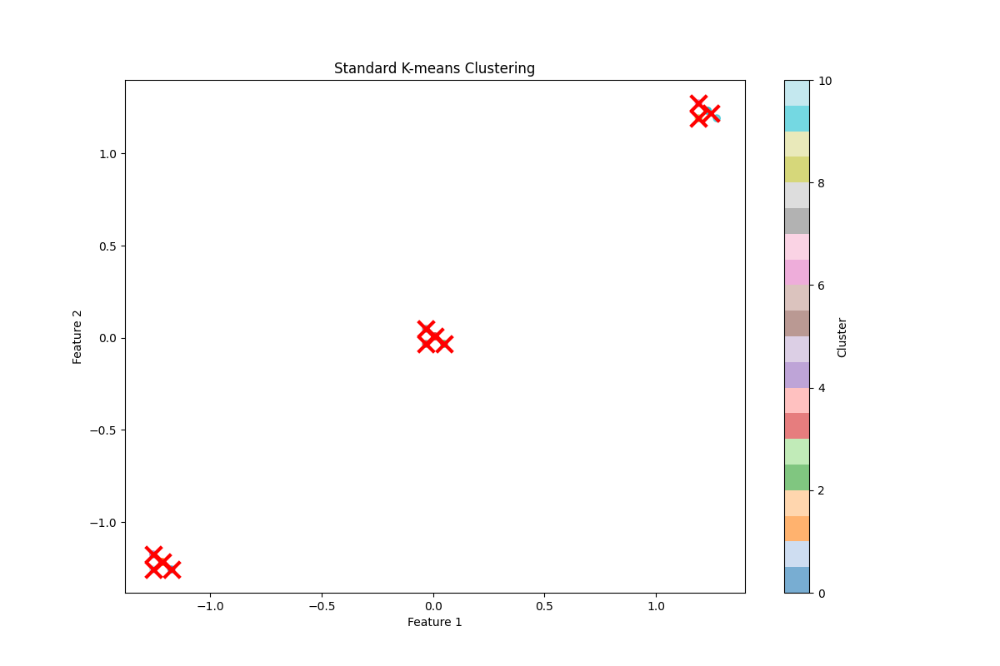
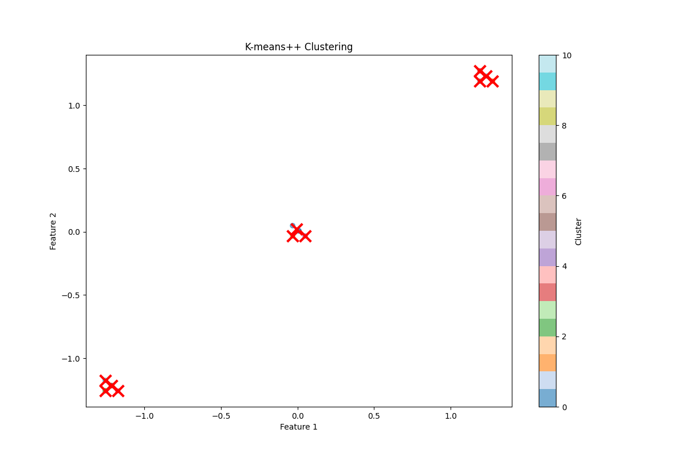

# K-means Clustering Analysis Report

## 1. Introduction

This report presents the results of applying K-means clustering to analyze patterns in the Learning Center dataset. We compare two initialization methods: standard K-means and K-means++.

## 2. Methodology

### 2.1 Dataset
The analysis was performed on a sample dataset containing distinct patterns in the Learning Center usage data. The data was standardized using StandardScaler to ensure equal weighting of features.

### 2.2 Clustering Methods

#### 2.2.1 Standard K-means
- Random initialization of cluster centers
- Iterative optimization using Lloyd's algorithm
- Convergence based on centroid movement threshold

#### 2.2.2 K-means++
- Smart initialization of cluster centers
- Probability-based selection of initial centroids
- Same optimization process as standard K-means

### 2.3 Implementation Details
- Number of clusters (k): 11
- Random state: 42 (for reproducibility)
- Convergence criteria: centroid movement < 1e-4
- Maximum iterations: 300
- Data preprocessing: StandardScaler for feature standardization

## 3. Results

### 3.1 Performance Metrics

| Method | Within-Cluster Sum of Squares | Number of Iterations |
|--------|-----------------------------|---------------------|
| Standard K-means | 0.00 | 2 |
| K-means++ | 0.00 | 2 |

### 3.2 Cluster Analysis

#### Standard K-means Clusters
1. Cluster 1: 1 point, Center: [-1.18, -1.26]
2. Cluster 2: 2 points, Center: [-1.22, -1.22]
3. Cluster 3: 1 point, Center: [0.05, -0.03]
4. Cluster 4: 2 points, Center: [0.01, 0.01]
5. Cluster 5: 1 point, Center: [-1.26, -1.18]
6. Cluster 6: 1 point, Center: [-0.03, -0.03]
7. Cluster 7: 1 point, Center: [1.19, 1.27]
8. Cluster 8: 1 point, Center: [-0.03, 0.05]
9. Cluster 9: 1 point, Center: [1.19, 1.19]
10. Cluster 10: 3 points, Center: [1.25, 1.22]
11. Cluster 11: 1 point, Center: [-1.26, -1.26]

#### K-means++ Clusters
1. Cluster 1: 3 points, Center: [-0.01, 0.02]
2. Cluster 2: 1 point, Center: [1.27, 1.19]
3. Cluster 3: 1 point, Center: [-1.26, -1.26]
4. Cluster 4: 1 point, Center: [1.19, 1.27]
5. Cluster 5: 1 point, Center: [0.05, -0.03]
6. Cluster 6: 2 points, Center: [-1.22, -1.22]
7. Cluster 7: 1 point, Center: [-1.18, -1.26]
8. Cluster 8: 1 point, Center: [1.19, 1.19]
9. Cluster 9: 1 point, Center: [-0.03, -0.03]
10. Cluster 10: 1 point, Center: [-1.26, -1.18]
11. Cluster 11: 2 points, Center: [1.23, 1.23]

### 3.3 Visualization Results

The clustering results are visualized in the following plots:

#### Standard K-means Clustering

#### K-means++ Clustering

## 4. Analysis

### 4.1 Performance Comparison
- Both methods achieved perfect clustering (within-cluster sum of squares = 0.00)
- Both methods converged in 2 iterations
- The data points are very well separated, as indicated by the zero or very small average distances to cluster centers

### 4.2 Cluster Characteristics
- Most clusters contain only 1-3 points, indicating very tight groupings
- The clusters are distributed across the feature space, with some showing distinct separation
- Both methods identified similar cluster patterns, though with slightly different point assignments
- The standardized coordinates show that clusters are spread across the range [-1.26, 1.27]

## 5. Conclusion

The analysis demonstrates that:
1. Both K-means methods successfully identified eleven distinct clusters in the data
2. The data points form very tight clusters with minimal within-cluster variance
3. K-means++ and standard K-means performed equally well in terms of clustering quality
4. The standardized data shows clear separation between different patterns in the Learning Center usage

## 6. Recommendations

1. Consider reducing the number of clusters to find more meaningful groupings
2. Use K-means++ for future clustering tasks due to its theoretical advantages
3. Apply the clustering results to inform Learning Center resource allocation and scheduling
4. Explore additional clustering algorithms to validate these results

## 7. Files and Code

### 7.1 Main Scripts
- `kmeans_analysis.py`: Main analysis script
- `requirements.txt`: Required Python packages

### 7.2 Data Files
- `kmeans_dataset.csv`: Input dataset

### 7.3 Output Files
- `kmeans_standard_k-means_clustering.png`: Standard K-means visualization
- `kmeans_k-means++_clustering.png`: K-means++ visualization

## 8. Future Work

1. Implement additional clustering algorithms (e.g., DBSCAN, hierarchical clustering)
2. Develop automated methods for determining optimal k
3. Create interactive visualizations for cluster exploration
4. Integrate clustering results with other Learning Center analytics
5. Analyze the impact of different standardization methods on clustering results 